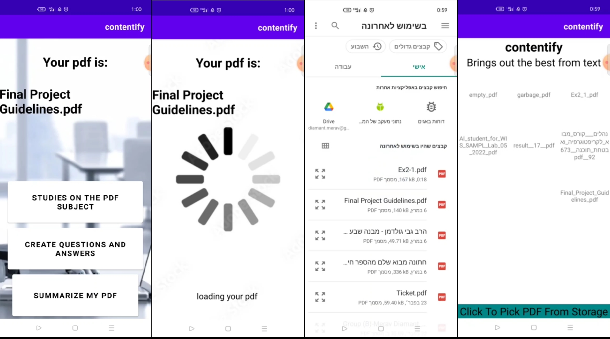

# My-Android-Apps
Kotlin, Android Studio, MVVM, DynamoDB, AWS lambdas.

## Application Description
1) Upload pdf's to cloud.
2) Generate a summary of it.
3) Generate Questions and Answers from the content, for quizzes.
4) Find links for articles and studies related to pdf's content.

## Frontend
Written in Kotlin. 
The Application has 5 screens, separated as fragments and adhere to MVVM architecute. 
The first screen is a welcome screen with recycle view
of pdf’s. 
The recycle works with the concept of MVVM while the data is taken and
upload to the DynamoDB on aws. 
On the left screen there are 3 buttons to navigate to the three results screens. 
 

The remaining 3 Fragments are much simpler, a simple scroll view that get’s his text
with a matched getter lambda specific bucket using url.

## Backend
The backend is based on AWS. 
The data is stored using DynamoDB, five S3 Buckets. 
The logic is handled using 9 AWS lambdas with python.
The app has 5 URLs to connect with AWS compnents.
  

On the home screen - The last 10 pdf’s are taken from the DB and shown
to the user using get_pdfs aws lambda.
  
The uploading is to a S3 Bucket which we call pdfBucket and performed with url which we get via pdf_uploader aws lambda.
  
For every new pdf we process his data with the pdf_processing lambda which triggered after first uploading.
  
We want for every new text to process his data. 
The summarize_processing lambda is triggered after the text is uploaded to the text bucket. 
When the summarized text is inserted to the appropriate bucket, the Studies processing
is triggered and when the studies text is put into his bucket, the Q&A processing lambda
is triggered. All those stages work closely with the statuses of the item in the DB.
  

The Summarized Fragment use the get_summary lambda that retrieve text from SummerizedBucket. 
In the same way we have Questions Fragment with get_question lambda and question bucket. 
At last we have the studies Fragment with get_studies and studies bucket. 
The app knows if the data is ready via the status from the DynamoDB. 
  

## The Challenge
Our first idea was to take NN models and do a fine tuning, after short
consultation and searching we understood it’s not easy task, especially the Question
and Answers part. 
Then we tried To use trained models, it took a lot of time to find the
correct ones and make the connections and adaptions to our goal. 
Lastly, after we found a solution, we encounter a problem of deploying those big models to aws. 
The fact that aws lambda runs on Linux was the final straw, the models and libraries were
problematic to import. 
After all this story we chose to use only Chat GPT through Openai API.
